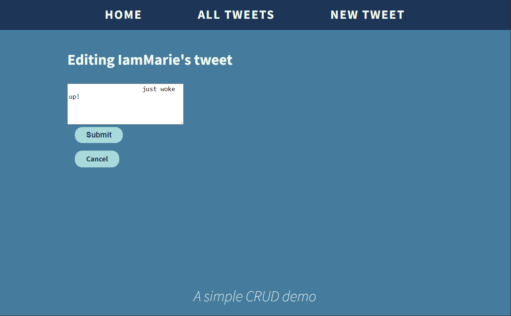

&nbsp;
# Simple CRUD Practice
&nbsp;
:memo: **Note:** 
- This repo does not have error handling for getting the user input yet. 
- This repo only used an array of objects to mimic a database
  - The purpose of this repo is just to show how RESTful routing works as well as incorporating 
templates, partials, and static files along with <b>Node.js and Express</b>

## To run this on your local machine:
1.  Make sure you have Node.js downloaded in your local machine before
downloading the code
2.  Go to the correct path in your terminal and type `npm install` to
install all the dependencies listed in the <b>package.json</b> file
3.  Run using the command `node index.js` or `nodemon index.js`

&nbsp;
&nbsp;

## This is a simple CRUD demo built with:

1.  <b>Extended Javascript (EJS)</b> - I used this to create a
template for each tweets when viewing it and also to render these
files on a certain route. The files are located in the <ins>resource
(tweets) directory under the views directory.</ins>
    *   There is also a directory named partials inside the tweets
directory where it contains the common parts of each templates
including the <ins>header, navbar, and footer</ins>
2.  <b>Bootstrap</b> - I incorporated a little bit of bootstrap just
to practice on how to serve files. <ins>Located in the public
directory</ins>
3.  <b>Express</b> - I used a Node.js framework to create a RESTful
Routes to achieve a CRUD functionality. <ins>This is written in
index.js file</ins>
4. <b>Other Packages</b> - I also used <ins>UUID and
method-override</ins> packages to generate a unique ID for each object
and a method override to allow a PATCH and DELETE http verb on the
forms.

&nbsp;
&nbsp;

## Previews: 

## Summary of the Restful Routes:
1.  <b>GET /tweets</b> - display all the tweets
2.  <b>GET /tweets/new</b> - displays a form to create a new tweet
3.  <b>POST /tweets</b> - creates a new comment on the server
4.  <b>GET /tweets/:id</b> - read a specific tweet
5.  <b>GET /tweets/:id/edit</b> - form to edit a specific tweet
6.  <b>PATCH /tweets/:id</b> - updates a specific tweet on the server

&nbsp;
&nbsp;

